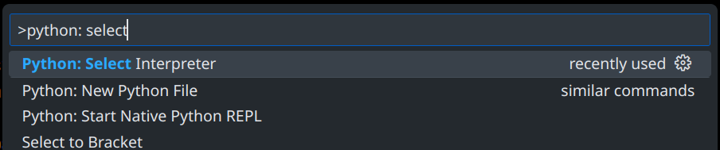
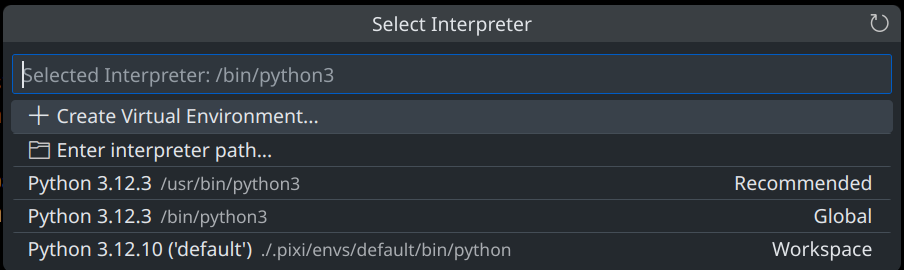
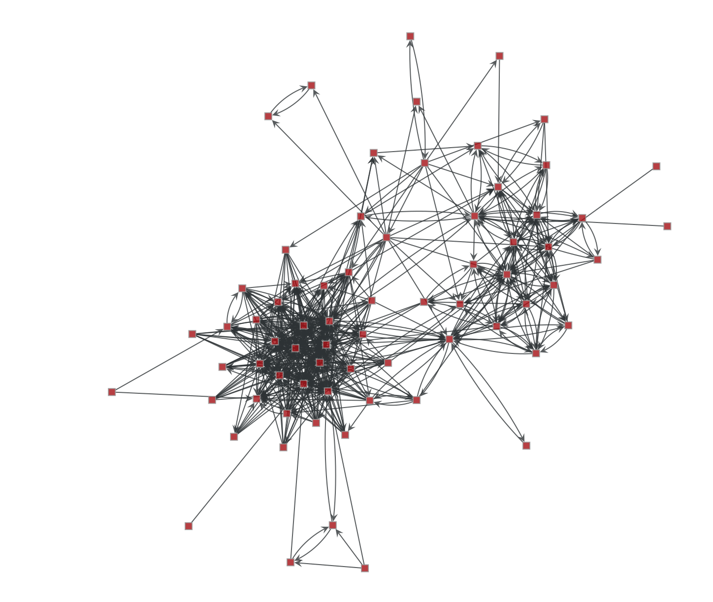
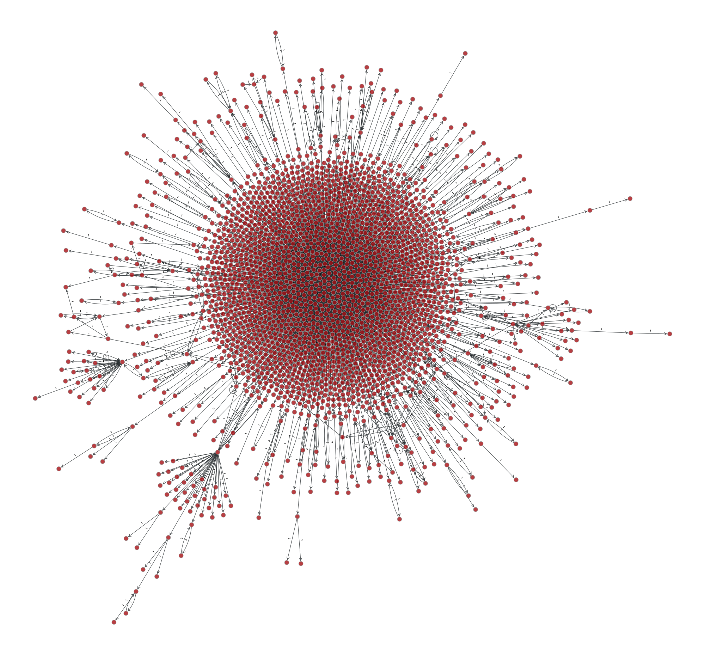

# Bluesky Report (Segona Pràctica AP2, Primavera de 2025)

En aquesta pràctica seràs el CEO d'una _start-up_ que ofereix un
servei molt valuós per a un usuari de la xarxa social
[Bluesky](https://bsky.app): un **informe sobre els seus seguidors** i
la seva xarxa propera.

Donat un usuari hipotètic `customer.bsky.social`, que serà en nostre
"client", la pràctica consta de 3 parts:

1. Obtenir 2 grafs: un a partir dels seguidors de
   `customer.bsky.social` i  
   l'altre utilitzant els _threads_ (o "converses") entre usuaris,
   utilitzant la API de Bluesky.

2. Analitzar els grafs obtinguts al pas 1 per calcular mètriques que
   puguin ser d'interès pel client.

3. Generar automàticament un informe que faci un resum de les dades
   trobades utilitzant text i gràfics.

L'aprenentatge que s'espera en el projecte és:

-   Poder utilitzar [`graph-tool`](https://graph-tool.skewed.de/) de
    forma bàsica per analitzar i visualitzar grafs.
-   Aplicar algoritmes de grafs per resoldre un problema realista,
    alhora que s'és conscient de la seva eficiència (en ordres de
    creixement).
-   Utilitzar [`click`](https://click.palletsprojects.com/en/stable/)
    de forma bàsica per crear eines a la línia de comandes.

## Instal·lació

Per començar amb el projecte cal clonar el repositori (o
descarregar-ne un ZIP) i instal·lar els paquets necessaris. Per fer la
instal·lació més fàcil, cal tenir instal·lat
[Pixi](https://pixi.sh/latest/), que automatitza tot el procés.

La instal·lació té un pas previ en Windows, donat que `graph-tool` requereix el WSL (Windows Subsystem for Linux), que permet tenir binaris de Linux funcionant en Windows.

### WSL (només si esteu a Windows)

En Windows el primer pas és instal·lar (si no el teniu ja), el WSL ([Windows Subsystem for Linux](https://ca.wikipedia.org/wiki/Windows_Subsystem_for_Linux)), amb:

```sh
wsl --install
```

Aquesta instal·lació por trigar força temps i ocupar molt d'espai (perquè conté una part important de tots els programes d'una distribució d'Ubuntu).

Un cop instal·lat el WSL, només cal seguir les instruccions per Linux tenint en compte que les comandes que surten s'han d'entrar en el terminal de WSL. 

💡 **WSL amb VSCode**: En VSCode, la barra d'estat té un botó a l'esquerra de tot amb dos signes "><" com:


Si premeu aquest botó, VSCode us mostra un menú a on pots triar si vols fer servir un altre "sistema", i quan tens instal·lat WSL, us sortirà una opció "WSL". Al triar-la VSCode utilitza com a sistema intern el WSL, i els terminals oberts dins de VSCode són tots ja a dins el WSL. 

### Instal·lació per Linux, MacOS i WSL

Així doncs, només dos passos haurien de ser necessaris:

1. Si no el teniu ja, cal instal·lar Pixi amb:

    ```sh
    curl -fsSL https://pixi.sh/install.sh | sh
    ```

2. Demanar-li a Pixi que instal·li les dependències del projecte (que
   ja estan registrades a `pixi.toml`) amb:

    ```sh
    pixi install
    ```

Pixi gestiona tota una instal·lació de Python, així que el directori
`.pixi` (ocult a Linux i MacOS) pot ocupar molt d'espai (> 1GB no és
extrany).

Per treballar amb el projecte, cal tenir actiu l'entorn instal·lat,
cosa que des del terminal s'aconsegueix amb:

```sh
pixi shell
```

### Ús amb VSCode

Si treballeu amb VSCode es pot escollir com a intèrpret de Python el
que Pixi instal·la, de manera que podeu treballar còmodament simplement obrint un terminal i ja tindreu activat l'entorn de Pixi amb el `graph-tool` instal·lat, etc. 

Cal seguir els següents passos:

-   Prémer F1 (o Ctrl+Shift+P), per obrir una finestra de comandes.
-   Escriure "Python: Select", i veureu que les comandes es filtren i
    només surten les que contenen el text escrit:

    

    Cal escollir la opció "**Python: Select Interpreter**".

-   Després, VSCode ens mostra els possibles intèrprets que troba:

    

    En l'exemple, l'intèrpret que ens interessa és el tercer. Es veu
    perquè la ruta en el disc és `.pixi/envs/default/bin/python`. I _no_ coincideix amb la opció recomanada 😉.

    Si apareix aquesta opció, només cal seleccionar-la.

-   Si no apareix, cal seleccionar la opció "Enter interpreter path..." i posar
    el path a mà: `.pixi/envs/default/bin/python`.

Un cop fet això, obrint la carpeta del projecte, sempre que s'obri un terminal surt com a prefix "`(default)`" a cada _prompt_, que ens diu que l'entorn que Pixi ha instal·lat està actiu.

### Paquets utilitzats

Apart del familiar `mypy`, el projecte utilitza els següents paquets
de Python, que es treballen en el projecte:

-   [`graph-tool`](https://graph-tool.skewed.de/): una llibreria molt
    potent (i ràpida) per treballar amb grafs.

-   [`click`](https://click.palletsprojects.com/en/stable/): una
    llibreria que permet simplificar molt la creació d'eines a la
    línia de comandes.

A més, per fer les consultes a Bluesky, també s'utilitzen alguns
altres paquets, malgrat el codi proporcionat (`bsky.py`) els
embolcalla i en principi no caldrà que els conegueu de primera mà:
[`requests`](https://requests.readthedocs.io/en/latest/) per fer
peticions HTTTP;
[`requests_cache`](https://requests-cache.readthedocs.io/en/stable/),
per fer _caching_ de les peticions; `aiohttp`, per poder fer moltes
peticions a Bluesky alhora, i `aiohttp-client-cache`, per fer
_caching_ d'aquestes últimes.

(Nota: el _cache_ de les peticions es guarda en un fitxer
`bsky_cache.sqlite` que és una base de dades SQLite i pot ocupar,
també, força espai.)

### `bsky.py`

El codi per cridar l'API de la xarxa social Bluesky ja es dóna fet, i
està al fitxer `bsky.py`. El codi també declara tipus MyPy per
comoditat a l'hora de cridar les funcions.

Abans d'explicar les funcions, convé fer explícita la següent
terminologia:

| Terme    | Significat a Bluesky                                            |
| -------- | --------------------------------------------------------------- |
| DID      | Identificador únic per a un usuari                              |
| _handle_ | Nom d'usuari incloent el domini, com ara `customer.bsky.social` |
| _post_   | Publicació d'un usuari (com un "tuit" de X)                     |
| _repost_ | Re-publicació d'un _post_ per un usuari diferent a l'autor      |
| _thread_ | Arbre de publicacions relacionades (respostes)                  |

Els _handles_ són una forma de facilitar el fet de referir-nos als
usuaris, però internament la xarxa fa servir DIDs per identificar als
usuaris.

Les funcions són les següents:

-   `get_follower_handles(handle: str) -> list[str]`: Obté una llista
    dels _handles_ (o noms d'usuari) dels seguidors d'un usuari donat
    (també pel _handle_).

-   `get_followers(handle: str) -> list[Profile]`: Obté les dades
    completes (de tipus `Profile`) dels seguidors d'un usuari, donat
    el seu _handle_.

-   `get_feed(handle: str, limit: int = 20) -> list[Post | Repost]`:
    Obté una llista de tots els _posts_ d'un usuari a partir del seu
    _handle_.

-   `get_profiles(handles: list[str]) -> list[Profile]`: Obté els
    perfils complets de tots els usuaris donada una llista de
    _handles_.

-   `get_thread(uri: str) -> Thread`: Obté un post a partir de la seva
    URI.

-   `get_relationships(did: str, others_dids: list[str])`: Obtenir un
    llistat de relacions entre un usuari d'interès (`did`) i una
    llista d'altres usuaris (`others_dids`). Aquesta funció retorna
    seguidors i seguits de `did` només a dins del conjunt
    `others_dids`.

#### Ús a la línia de comandes

El fitxer `bsky.py`, a més, implementa una forma d'accedir a les
funcions des de la línia de comandes (fent servir el paquet `click`),
per tal de poder fer proves puntuals. Executant el fitxer com a
programa principal amb

```sh
python3 bsky.py
```

es mostra l'ajuda, i cada subcomanda permet cridar una de les funcions
esmentades anteriorment. Les que necessiten opcions les documenten a
l'ajuda. Un exemple: per obtenir la llista de seguidors d'un usuari
fariem

```sh
python3 bsky.py followers fib.upc.edu
```

Al final del fitxer `bsky.py` es poden veure les funcions prefixades
amb `cmd_` que són les que implementen cada subcomanda. La majoria
simplement obtenen opcions o arguments de `click`, criden una funció
de les esmentades anteriorment, i mostren els resultats a la sortida.

### `graph-tool`

El paquet `graph-tool` és molt complet i permet crear grafs i
analitzar-los amb tot tipus d'algoritmes. A més, genera
representacions gràfiques en SVG o PDF, que seran necessàries pel
_report_. La
[documentació](https://graph-tool.skewed.de/static/docs/stable/) és
completa i molt ben estructurada, i no val la pena repetir-la aquí.

Tanmateix, és bo tenir en compte els següents punts abans de començar
a utilitzar `graph-tool`:

-   Els grafs són objectes, amb una representació "opaca" (és a dir,
    de la qual no veiem l'interior), i tenen un seguit de mètodes per
    manipular-los: `add_vertex`, `add_edge`, etc. Aquests mètodes
    retornen objectes `Vertex` i `Edge` que són, també, opacs.

-   Es pot guardar un graf amb el mètode `save` (recomanem el format
    `gt`, el més eficient). Després es pot recuperar amb `load`.
    Guardant els grafs obtinguts a la Part 1 en diferents fitxers, la
    Part 2 es pot fer sense fer servir la xarxa.

-   Als vèrtexs o arestes d'un graf se'ls poden afegir **propietats**
    en qualsevol moment. Aquestes propietats són de tipus
    [`VertexPropertyMap`](https://graph-tool.skewed.de/static/docs/stable/autosummary/graph_tool.VertexPropertyMap.html)
    o
    [`EdgePropertyMap`](https://graph-tool.skewed.de/static/docs/stable/autosummary/graph_tool.EdgePropertyMap.html)
    i són objectes "externs" al graf, així que se'n poden tenir tants
    com es vulgui.

-   Per crear una propietat dels vèrtexs es pot fer servir el mètode
    [`new_vertex_property`](https://graph-tool.skewed.de/static/docs/stable/autosummary/graph_tool.Graph.html#graph_tool.Graph.new_vertex_property)
    del graf, que rep com a paràmetre el tipus de cada valor
    (`"string"`, `"int"`, `"object"`, etc.).

-   Les propietats, malgrat començar com a independents del graf, es
    poden fer **internes** al graf. Per exemple, el codi següent

    ```python
    handle_property = graf.new_vertex_property("string")
    graf.vertex_properties["handle"] = handle_property
    ```

    crea una propietat de tipus "string" i la instal·la com a pròpia
    del graf i amb nom "handle" a la segona instrucció. El fet de fer
    les propietats internes té una conseqüència important, i és que es
    **guarden al fitxer** en el moment de fer `save` i es recuperen
    amb `load` (molt útil per la Part 1).

-   Les propietats dels elements d'un graf es poden fer servir en el
    moment de pintar-lo amb `graph_draw`, posant-les com a
    característiques del dibuix, com ara colors o tamanys. Això és el
    que fan servir els algoritmes de _layout_ dels grafs, perquè només
    calculen una posició per a cada vèrtex, que és bàsicament una
    propietat nova, i aquesta propietat es fa servir a l'hora de
    pintar.

-   A partir d'una propietat se'n pot obtenir una de nova per
    "transformació" amb el mètode `transform`. Per exemple, si
    disposem d'una propietat `size` (de tipus `"int"`) i en volem una
    que sigui de tipus `"bool"` que indiqui si el tamany és major que
    1, farem:

    ```python
    gt1_property = size_property.transform(lambda sz: sz > 1)
    ```

    La funció `lambda sz: sz > 1` s'aplica a cada valor de
    `size_property` per obtenir els nous valors de la propietat
    `gt1_property`. En particular, hi ha una transformació comú que
    `graph-tool` ja proporciona, que és
    [`prop_to_size`](https://graph-tool.skewed.de/static/docs/stable/autosummary/graph_tool.draw.prop_to_size.html),
    molt recomanable alhora de visualitzar grafs.

## Obtenció i anàlisi dels grafs

### Graf de seguidors

Donat que la xarxa social Bluesky té a la vora de 50 milions
d'usuaris, treballar amb el graf complet no és factible, així que un
dels grafs que obtindrem serà un subgraf del graf de seguidors,
restringit als vertexs que són seguidors del "client".

En particular, anomenarem $G_B = (V_B, E_B)$ el graf dirigit complet
de seguidors de Bluesky, a on una aresta $(a, b)$ indica que l'usuari
$a$ segueix a $b$. Donat un subconjunt d'usuaris $U$ de Bluesky (molt
menor que el total), la _restricció_ del graf $G_B$ a $U$ és un graf
$G_U = (V_U, E_U)$ a on $V_U$ és el subconjunt de vèrtexs $v\in V_B$
que representen als usuaris $U$, i $E$ són les arestes $(a, b)\in E_B$
tals que $a\in V_U$ i $b\in V_U$. És a dir, només les arestes que
tenen com a origen y destí un vèrtex de $V_U$.

Així doncs, la obtenció del graf consta dels passos següents:

-   Obtenir els seguidors de l'usuari "client".
-   Fer servir les funcions de `bsky.py` per esbrinar les relacions
    entre aquests usuaris i formar un graf amb `graph-tool`.
-   Guardar el graf en un fitxer.

Aquest graf representa les conexions socials que adquireixen els
usuaris al seguir-se uns als altres.

El següent exemple és el graf de seguidors d'un usuari amb uns 80
seguidors:



### Fusió de _threads_

Per altra banda, els _threads_ que tenen com a origen l'usuari client,
ens informen de la propagació a través de la xarxa del seu contingut,
i superposant les relacions de resposta que hi ha en aquests _threads_
podem reconstruir un graf que representa millor la interacció entre
usuaris.

En concret, suposem que disposem d'un conjunt de _threads_ $t_k$,
cadascun essent un graf (de fet, un arbre) $G_k = (V_k, E_k)$ a on els
vèrtexs $V_k$ són els usuaris que han participat en el _thread_ $t_k$,
i una aresta $(a, b)\in E_k$ representa la direcció de propagació de
la interacció des d'un usuari $a$ (autor d'un post) a un altre $b$,
que li respòn.

Es pot formar un graf que representa el flux d'interacció agregat
fusionant els threads $t_k$ en un sol graf, en el qual els vèrtexs són
la unió de $V_k$ i les arestes són la unió de $E_k$. Opcionalment, es
pot afegir una propietat a cada aresta que compta les repeticions
d'arestes en els _threads_ $t_k$, de tal manera que les interaccions
més freqüents entre parelles d'usuaris tinguin un pes major.

Per tant, la obtenció del graf consta dels passos següents:

-   Obtenir el _feed_ del "client" amb les funcions del paquet `bsky`.
-   Per a cada _post_ del _feed_, obtenir l'arbre sencer del _thread_.
-   Processar tots els _threads_ i crear un graf a partir de totes les
    interaccions trobades.

El següent exemple mostra el graf de fusió de threads de més de 10
respostes de l'usuari [MKBHD](https://bsky.app/profile/mkbhd.com):



### Anàlisi

Un cop tenim els dos grafs, es tracta de llegir-los i analitzar-los
per extreure'n informació interessant per al "client".

Malgrat a teoria s'han estudiat molts algoritmes útils, amb dades
reals és comú que no acabin de funcionar bé del tot i calgui "netejar"
les dades, fer retocs o posar límits empírics per ajudar a extreure
informació o per visualitzar les dades de forma més clara. Per sort,
amb una eina com `graph-tool` és poc costós aplicar algoritmes que
puguin ser molt indicats per al problema, malgrat no els haguem
estudiat directament a teoria.

Com a mínim, el projecte ha de treballar 3 dels 6 punts detallats a
sota, dels quals donem idees per començar però suposem que cadascú
desenvoluparà amb el seu propi criteri. En alguns punts es donen
diverses opcions, no perquè es desenvolupin totes, sinó perquè cadascú
prengui la que més interès li desperta.

Amb el graf de seguidors:

-   **Comunitats**: amb el graf de seguidors, agrupar els usuaris en
    comunitats i reportar els tamanys de comunitats que apareixen.
    L'algoritme més senzill aplicable és
    [`label_components`](https://graph-tool.skewed.de/static/docs/stable/autosummary/graph_tool.topology.label_components.html#graph_tool.topology.label_components),
    però sovint aquest algoritme no és prou robust o no és del tot
    informatiu. Part del projecte és buscar maneres de millorar-ne els
    resultats.

-   **Reputació entre els seguidors**: Dels seguidors del client, per
    les seves connexions amb altres usuaris es pot deduïr la seva
    reputació, i l'algoritme
    [PageRank](`https://graph-tool.skewed.de/static/docs/stable/autosummary/graph_tool.centrality.pagerank.html`)
    és un bon començament per esbrinar-ho.

-   **Usuaris "competidors"**: es poden mirar aquells usuaris que
    poden ser equivalents al nostre client, calculant el
    [Closeness Centrality](https://en.wikipedia.org/wiki/Closeness_centrality),
    que a `graph-tool` és la funció
    [`closeness`](https://graph-tool.skewed.de/static/docs/stable/autosummary/graph_tool.centrality.closeness.html),
    donat que aquesta mesura és molt alta en el client (donada la
    distància 1 de tots els seus seguidors). Si algun vèrtex del graf
    té aquesta mesura propera a 1, es pot pensar que és equivalent al
    client (ja que per definició ell està connectat a tots els
    seguidors a distància 1).

Amb el graf de fusió de threads:

-   **Distància de propagació**: Calculant les distàncies màximes des
    del client als vèrtexs més allunyats, es té una idea del màxim
    abast de la influència del client en el seu entorn, i amb un
    histograma de les quantitats de nodes a cada distància es pot
    quantificar millor aquesta influència.

-   **Vèrtexs de sortida**: un usuari valuós pot ser aquell que,
    pertanyent als seguidors directes del client, consistentment ha
    produït interaccions d'usuaris més enllà del conjunt de seguidors
    directes del client, i per tant és una "porta" d'expansió a nous
    públic per al client.

-   **Punts de pas**: utilitzant una variació de la
    [Betweenness Centrality](https://en.wikipedia.org/wiki/Betweenness_centrality),
    un usuari valuós és aquell que pertany a una fracció major dels
    camins des del client fins als usuaris més allunyats (donat que el
    graf té forma d'estrella). Aquests usuaris canalitzen la major
    part de les interaccions amb el client.

Tot i no ser obligatori, havent implementat 3 dels 6 punts anteriors,
es valorarà que el projecte explori altres aspectes que puguin fer
l'informe més complet i interessant. (Si es fan just 3 apartats i tot
és correcte, la nota que es pot esperar és als voltants del 8.)

## El Bluesky Report

L'informe vàlid més senzill possible és una carpeta amb un fitxer de
text que es digui `bluesky-report-customer.bsky.social.txt` acompanyat
de tants PDFs o SVGs com visualitzacions de grafs s'hagin fet. En el
text es pot posar el que es cregui oportú en un format que sigui
còmode de llegir. (Es recomana començar així.)

Tanmateix, per fer-li al nostre "client" la feina més fàcil, es
valorarà l'ús del paquet `fpdf2` per generar un sol PDF anomenat
`bluesky-report-customer.bsky.social.pdf` amb l'informe complet,
havent esborrat la carpeta i els fitxers intermitjos.

El fet d'afegir el nom del client al fitxer ajuda a saber de qui es
tracta i alhora de no sobreescriure informes de clients diferents.

### Grafs en SVG

Per incloure SVGs al PDF cal escriure codi com el següent:

```python
import fpdf

pdf = fpdf.FPDF(unit="cm", format="A4")
pdf.add_page()

# Llegeix el SVG i el transforma en comandes per pintar en un PDF
svg = fpdf.svg.SVGObject.from_file("some.svg")
svg.draw_to_page(pdf)

# Produeix el PDF
pdf.output("report_with_image.pdf")
```

Això funciona bé amb SVGs senzills, però els que genera `graph_tool` tenen algunes característiques que `fpdf2` no entén, i dóna un error d'execució. La solució és transformar els SVGs per "simplificarlos" amb una utilitat escrita en Python que es diu [`scour`](https://github.com/scour-project/scour). Per sort, `scour` produeix SVGs que estan lliures d'aquestes parts que `fpdf2` no entén.

Scour es pot instal·lar simplement amb `pixi install scour` i llavors ja el tindreu en l'entorn que s'obre al fer `pixi shell` i des d'un terminal és suficient amb:

```bash
scour entrada.svg > sortida.svg
```

Per transformar `entrada.svg`, que prové de `graph_tool`, en `sortida.svg`, que es podrà carregar amb `fpdf2`.

## Instruccions

### Equips

Podeu fer aquest projecte sols o en equips de dos. En cas de fer-lo en
equip, la càrrega de treball dels dos membres de l'equip ha de ser
semblant i el resultat final és responsabilitat d'ambdós. Cada membre
de l'equip ha de saber què ha fet l'altre membre. Ambdós membres són
responsables de tot el treball.

Els qui decidiu fer el segon projecte en un equip de dos estudiants,
envieu abans de les 23:59 del dia 1 de maig de 2025 un missatge al
professor Pau Fernández amb aquestes característiques:

-   des del compte oficial (`@estudiantat.upc.edu`) del membre amb
    l'email més baix (segons l'ordre lexicogràfic),
-   amb tema (subject) "Equips AP2 2025",
-   amb el nom dels dos estudiants de l'equip al cos del missatge,
-   fent còpia (CC) al email del compte oficial de l'altre estudiant.

Si no es rep cap missatge d'equip per aquesta data, es considerarà que
feu la pràctica sols (i no us podreu "aparellar" més tard). Si heu
enviat aquest missatge, es considerarà que feu la pràctica junts (i no
s'admetràn "divorcis").

### Lliuraments

La pràctica tindrà 3 lliuraments, utilitzant el Racó:

| Part   | Termini                                      | Pes     |
| ------ | -------------------------------------------- | ------- |
| Part 1 | dimarts 6 de maig de 2025 a les 23:55 CEST   | 3 punts |
| Part 2 | diumenge 25 de maig de 2025 a les 23:55 CEST | 5 punts |
| Part 3 | dimarts 3 de juny de 2025 a les 23:55 CEST   | 2 punts |

L'entrega de la Part 2 inclou la Part 1, i la Part 3 inclourà les 3
parts.

Per a cada lliurament, cal lliurar un fitxer ZIP que, al
descomprimir-se, generi el directori del projecte. A més, s'han
d'incloure els resultats d'almenys 2 grafs diferents. Per a la primera
i segona entrega només cal que hi hagi el fitxer del graf. La tercera
ja tindrà l'informe pròpiament dit. (Sobretot, poseu al ZIP només els
fitxers rellevants, esborreu fitxers que no tinguin importància per
facilitar la correcció.)

Els vostres fitxers de codi en Python han de seguir
[les regles d'estil PEP8](https://www.python.org/dev/peps/pep-0008/).
Existeix una extensió de Visual Studio Code, anomenada
[Black Formatter](https://marketplace.visualstudio.com/items?itemName=ms-python.black-formatter),
que
[formata el codi automàticament](https://code.visualstudio.com/docs/python/formatting)
amb el format mencionat.

Els vostres programes en Python han d'usar `typing` en la mesura del
possible. Totes les funcions públiques han d'incloure el tipus dels
seus paràmetres i resultats.

### Consells

-   Documenteu el codi a mesura que l'escriviu.

-   Useu `click` per poder provar fàcilment les funcions que aneu
    fent, de forma acumulativa.

-   Anomeneu els grafs amb un nom que no se sobreescrigui en una
    execució posterior per no perdre dades importants (per exemple,
    posant al nom del fitxer el handle del client i la data-hora).

-   L'enunciat deixa obertes moltes qüestions intencionadament. Sou
    els responsables de prendre les vostres decisions de disseny i
    deixar-les reflectides adientment al codi i a la documentació.

-   Considereu que el projecté és la primera versió d'una aplicació
    que hareu d'anar millorant en els propers anys. Eviteu valors
    màgics, useu constants, definiu funcions per a càlculs suceptibles
    de ser reconsiderats en el futur...

-   Podeu ampliar les capacitats del vostre projecte mentre mantingueu
    les funcionalitats mínimes previstes en aquest enunciat. Ara bé,
    aviseu abans als vostres professors i deixeu-ho tot ben
    documentat.

-   Per evitar problemes de còpies, no pengeu el vostre projecte en
    repositoris públics.

-   Programeu poc. Penseu molt.

-   Divertiu-vos.

## Autors

-   Pau Fernández
-   Ona Siscart
-   Jordi Petit

Universitat Politècnica de Catalunya, 2025
